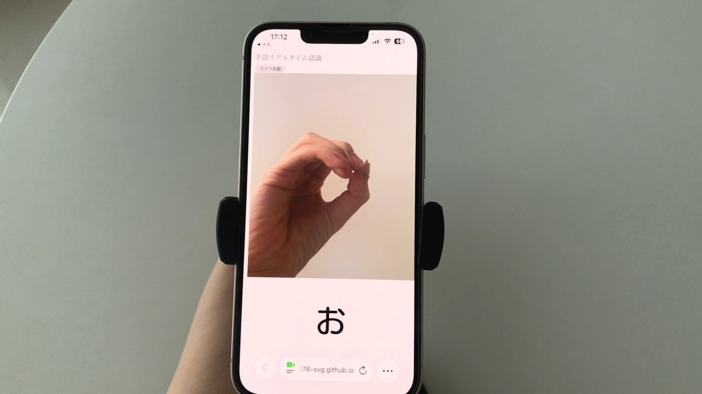

# 手話に興味を持ってもらうための簡単お試しスマートフォン用Webアプリ

デザイン演習IV(2年生後期)課題「操作にキーボードとマウスを使わない」制作作品。
手話のポーズを外側のカメラに向かって行うと画像認識で各ポーズに対応する文字が表示される。
画像の認識には、Teachable Machine を使用した。

[Demo](https://signlanguage076-svg.github.io/sign-lang/)

